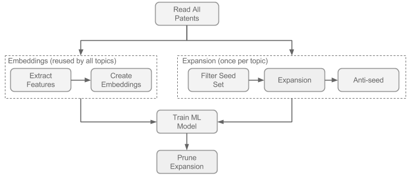

# Purpose
A note about the purpose of this repository. TODO(feltenberger,aabood)


## Creating a Patent Landscape

The figure 1 shows the high level flow to create a patent landscape. We'll walk through each of these in turn in the accompanying Jupyter Notebook.



## Requirements
Before we get started, you should install some requirements for running this notebook. We rely on TensorFlow and Google's Cloud infrastructure such as BigQuery, where we pull public patent data, and that needs to be installed and authorized. You need a few basics before continuing:
* Anaconda
* Jupyter Notebooks
* TensorFlow
* Google Cloud SDK
* BigQuery Python Client
* A few Python utilities

### Anaconda
I strongly recommend using Anaconda for this - it helps manage environments for Python, and these instructions will assume you're using it. Download Anaconda from [https://www.continuum.io/downloads](https://www.continuum.io/downloads).

Once Anaconda is installed, create an environment:
```
conda create -n patent-landscape python=3.5
source activate patent-landscape (or just: activate patent-landscape if you're in Windows)
```

### Jupyter Notebooks

To run the code in this notebook, you'll also need to install Jupyter. The following installs Jupyter and some utilities that let you toggle between different conda environments while inside a notebook.

```
conda config --add channels conda-forge
conda install jupyter ipython nb_conda=2.2.0
```

### TensorFlow

TensorFlow will work 'out of the box' with just your CPU. Since we're going to be building a model using neural networks, however, I highly recommend using GPU acceleration - training will be at least an order of magnitude faster with a modern GPU. You'll need to follow the TensorFlow instructions found [here](https://www.tensorflow.org/install/) for your platform. There are several steps to getting your GPU working for Deep Learning, so pay careful attention to the instructions. Note that only Nvidia chipset-based GPUs will work with TensorFlow.

To skip all the GPU acceleration and just get started, you can just run this command within your active conda environment:
```
pip install tensorflow
```

Also install tflearn, the high-level library on top of TensorFlow:
```
pip install tflearn
```

### Google Cloud SDK
Download and install Google Cloud SDK. You can download and install using [these](https://cloud.google.com/sdk/docs) instructions, or more conveniently:

```
pip install google-cloud
```

Once you have the `gcloud` client installed, you need to authorize it to access Google's Cloud on your behalf. From your active conda environment, run this command and follow the prompts:
```
gcloud auth application-default login
```

Finally, you'll also need to install the Google API Python Client and BigQuery extension to Pandas:
```
pip install google-api-python-client pandas-gbq
```

### Python Utilities

```
conda install numpy pandas h5py scipy scikit-learn matplotlib
```
